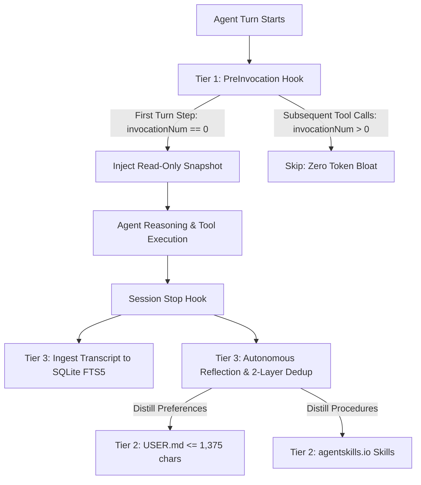

# AGENTS.md: Autonomous Agent Operational Manual & System Directives

> **Notice to Autonomous AI Coding Agents** (Claude Code, Antigravity, Cursor, Windsurf, Devin, Codex):
> This document defines your operational rules, memory architecture, provenance guardrails, and installation procedures when interacting with or deploying the Hermes Engine.

---

## 1. Agent Memory Architecture & Mental Model

You operate under a **3-Tier Memory Architecture** designed to eliminate context drift, prevent KV prefix-cache invalidation, and preserve user intent across sessions.



### Tier 1: Working Context Snapshot (Short-Term)
- Injected into your context automatically on turn step `0` (`invocationNum == 0`).
- **RULE**: The snapshot is **strictly read-only** during the turn. Never attempt to inject, mutate, or prepend memory strings mid-turn. Mid-turn prompt mutations invalidate the prefix cache and waste computational tokens.

### Tier 2: Mid-Term Curated Dual Memory
Two markdown files manage your operational memory:
- `USER.md` (User Profile & Personal Preferences): Hard limit $\le 1,375$ characters.
- `MEMORY.md` (Workspace Rules & Environment): Hard limit $\le 2,200$ characters.
- **Entry Delimiter**: Entries are separated strictly by `\n§\n`.
- **Two-Zone Memory Protection**:
  - **Anchor Zone (Index 0)**: The first entry contains core user identity and workspace invariants. It is **strictly immune** to automated eviction and cannot be removed via `remove` or `batch`. To update it, use the `replace` action explicitly.
  - **Dynamic Zone (Index $\ge 1$)**: Learned preferences and conventions. Evicted automatically in FIFO order when the character budget is exceeded.

### Tier 3: Long-Term Episodic Recall & Search
- All historical session transcripts are ingested into SQLite FTS5 (`state/state.db`) with Write-Ahead Logging (WAL).
- **Search Strategy**:
  1. Call `session_search(query="<search term>", limit=10)` to find relevant historical interactions.
  2. Review the BM25-ranked matches and highlighted snippets (bounded to 1,200 characters).
  3. If deeper context is needed, call `session_get_message(message_id=<id>, offset=0, limit=4000)` to paginate through the full content.

---

## 2. Provenance Model & Skill Mutation Guardrails

When modifying procedural skills (`skills/` directory), you must respect write-origin provenance:

| Action Context | `origin` Parameter | Rules & Restrictions |
| :--- | :--- | :--- |
| **Interactive User Request** | `origin="foreground"` | Granted when the user explicitly instructs you to create, edit, or delete a skill. You have full permission. |
| **Autonomous Background Reflection** | `origin="background_review"` | Set automatically during session stop hooks. <br>- **NEVER** overwrite or patch user-created skills.<br>- **NEVER** modify or delete pinned skills (`pinned: true`).<br>- Only create skills tagged with `created_by: "agent"`. |

---

## 3. Autonomous Setup Protocol (Agent Self-Installation)

If you are tasked with installing Hermes Engine on a new machine or environment, execute the following protocol:

### Step 1: Run Automated Installer
```bash
bash install.sh
```

### Step 2: Verify Test Suite
Ensure all 122 unit tests pass without error:
```bash
pytest tests/ -v
```

### Step 3: Verify Directory Structure
Ensure the standard directory layout exists:
```
~/.agents/
├── hooks.json
├── memories/
│   └── MEMORY.md
├── skills/
│   ├── .archive/
│   ├── .curator_backups/
│   └── .usage.json
└── state/
    └── state.db
```

### Step 4: FastMCP Configuration
Register `hermes-engine` in your agent's MCP configuration (`mcpServers`):
```json
{
  "mcpServers": {
    "hermes-engine": {
      "command": "python3",
      "args": ["<PATH_TO_REPO>/hermes_engine/server.py"]
    }
  }
}
```

---

## 4. MCP Tools Reference for Agents

### `memory`
```json
{
  "action": "get" | "add" | "replace" | "remove" | "batch",
  "target": "user" | "memory",
  "content": "<entry string>",
  "old_text": "<matching substring for replace/remove>",
  "operations": "[{\"action\": \"add\", \"target\": \"user\", \"content\": \"...\"}]"
}
```

### `skill_manage`
```json
{
  "action": "create" | "patch" | "write_file" | "delete",
  "name": "<skill-name>",
  "content": "<markdown content with YAML frontmatter>",
  "file_path": "<relative path within skill folder>",
  "old_string": "<string to replace>",
  "new_string": "<replacement string>",
  "origin": "foreground" | "background_review"
}
```

### `session_search`
```json
{
  "query": "<fts5 search query>",
  "limit": 10
}
```

### `session_get_message`
```json
{
  "message_id": 123,
  "offset": 0,
  "limit": 4000
}
```
