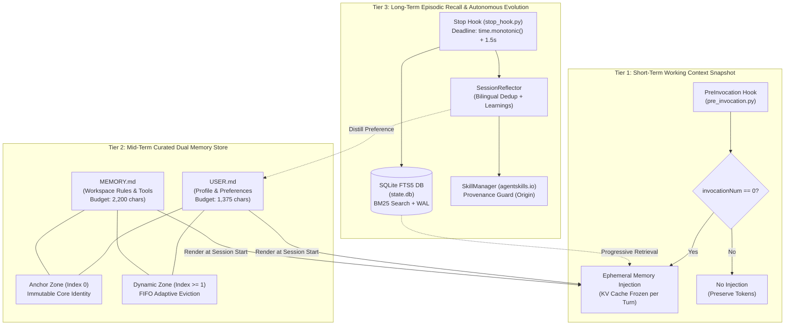

# Antigravity X Hermes Architecture Blueprint

[](https://www.python.org/downloads/)
[](https://github.com/jlowin/fastmcp)
[-green.svg)](https://www.sqlite.org/fts5.html)
[](tests/)
[](LICENSE)

> **A Production-Grade, Provenance-Guarded 3-Tier Memory Architecture & Autonomous Self-Evolution Engine for AI Coding Agents.**

Hermes Engine solves the three fundamental bottlenecks of long-running autonomous coding assistants: **context drift**, **prefix-cache invalidation**, and **hallucinatory preference mutation**. By decoupling interactive user turns from asynchronous out-of-band reflection, it delivers persistent memory and procedural skill distillation with zero mid-turn token bloat.

---

## Architecture Overview



---

## Core Innovations

### 1. 3-Tier Memory Decoupling
- **Tier 1 (Working Snapshot)**: Injected strictly on turn step `0` (`invocationNum == 0`). Subsequent tool executions receive zero injections, keeping the KV prefix-cache 100% stable.
- **Tier 2 (Curated Dual Markdown)**: Partitioned into `USER.md` ($\le 1,375$ chars) and `MEMORY.md` ($\le 2,200$ chars) separated by `\n§\n` delimiters with advisory `fcntl.flock` concurrency control.
- **Tier 3 (Episodic FTS5 DB)**: Complete session transcripts indexed with SQLite FTS5 (BM25 ranking), stripped of system envelopes (`<USER_SETTINGS_CHANGE>`, `<ADDITIONAL_METADATA>`), and queried via progressive retrieval.

### 2. Two-Zone Memory Protection Model
- **Anchor Zone (Index 0)**: Houses foundational user identity and repo invariants. Strictly immune to eviction and cannot be deleted by `remove` or `batch` actions.
- **Dynamic Zone (Index $\ge 1$)**: Dynamically evicts older transient entries in FIFO order when character budgets overflow. Emits transparent eviction telemetry to agents.

### 3. 2-Layer Deduplication Engine with Negation Conflict Guard
- **Layer 1**: Exact normalized string equality (case, whitespace, punctuation insensitive).
- **Layer 2**: Token-set Jaccard similarity ($J \ge 0.85$) with bilingual (Indonesian + English) negation conflict detection (`tidak`, `jangan`, `bukan`, `no`, `not`, `never`). Prevents polarity erasure between contradictory preferences.

### 4. Write-Origin Provenance Model
- `origin="foreground"`: Interactive user requests retain 100% control to create, patch, or delete any skill.
- `origin="background_review"`: Autonomous background reflection can only create agent-tagged skills. **Strictly prohibited** from modifying or deleting user-created skills or pinned skills (`pinned: true`).

### 5. Cooperative Monotonic Deadline Propagation
The `Stop` hook runs under a strict monotonic deadline (`time.monotonic() + 1.5s`). Database writes, preference deduplication, and skill creation check the deadline cooperatively, guaranteeing a sub-1.5s shutdown and zero terminal hangs.

---

## Quickstart

### Automated One-Command Installation
Run the self-contained portable installer on your machine:
```bash
git clone https://github.com/your-org/antigravity-hermes-blueprint.git
cd antigravity-hermes-blueprint
bash install.sh
```

### Self-Verification (126 Unit Tests)
```bash
pytest tests/ -v
```

### FastMCP Server Integration
Configure your AI agent (Antigravity, Claude Code, Cursor, Windsurf) by adding `hermes-engine` to your MCP configuration:

```json
{
  "mcpServers": {
    "hermes-engine": {
      "command": "python3",
      "args": ["/path/to/antigravity-hermes-blueprint/hermes_engine/server.py"]
    }
  }
}
```

---

## Repository Structure

```
.
├── AGENTS.md                  # Autonomous agent setup instructions & system prompt guide
├── README.md                  # System overview, specifications & quickstart
├── LICENSE                    # MIT License
├── pyproject.toml             # Build system & dependencies
├── requirements.txt           # Python package requirements
├── install.sh                 # One-click portable installer for human & agents
├── .gitignore                 # Cache, DB, environment, and lock ignores
├── hermes_engine/             # Canon source code package
│   ├── __init__.py
│   ├── config.py              # Dynamic root resolution (AGENTS_ROOT / ~/.agents / cwd)
│   ├── memory.py              # Tier 2 Dual Memory Store (Anchor + Dynamic Zone, Jaccard/Exact dedup)
│   ├── session_db.py          # Tier 3 SQLite FTS5 Episodic Recall & Sanitization Engine
│   ├── skills.py              # Provenance-guarded Skill Manager (foreground vs background_review)
│   ├── reflector.py           # Background Autonomous Distillation Engine
│   ├── server.py              # FastMCP Tool Server (memory, skill_manage, session_search, session_get_message)
│   └── hooks/
│       ├── __init__.py
│       ├── pre_invocation.py  # Tier 1 Short-Term Context Snapshot Injection Hook
│       └── stop_hook.py       # Tier 3 Monotonic Deadline Session Ingestion & Reflection Hook
├── scripts/
│   ├── __init__.py
│   └── curator.py             # Provenance anti-bloat & archive/backup rollback engine
├── templates/
│   ├── hooks.json.example     # Portable hook configuration example using {AGENTS_ROOT}
│   ├── USER.md.example        # Tier 2 User profile template (safe placeholder)
│   └── MEMORY.md.example      # Tier 2 Workspace rules template (safe placeholder)
├── tests/                     # 126/126 complete test suite
│   ├── __init__.py
│   ├── conftest.py
│   ├── test_config.py
│   ├── test_curator.py
│   ├── test_e2e_evolution.py
│   ├── test_hooks.py
│   ├── test_memory.py
│   ├── test_pre_invocation.py
│   ├── test_reflector.py
│   ├── test_server.py
│   ├── test_session_db.py
│   └── test_skills.py
└── docs/                      # Architectural Blueprints & Verification Specs
    ├── 01-architecture-overview.md
    ├── 02-two-zone-memory-spec.md
    ├── 03-episodic-recall-fts5.md
    ├── 04-agent-self-evolution.md
    └── 05-production-verification.md
```

---

## Architectural Documentation

For deep technical dives, review the specifications in `docs/`:
1. [01. Architecture Overview](docs/01-architecture-overview.md): Decoupled 3-tier memory & FastMCP interface.
2. [02. Two-Zone Memory Specification](docs/02-two-zone-memory-spec.md): Anchor Zone immunity, Dynamic Zone FIFO eviction, and Token-Set Jaccard deduplication.
3. [03. Episodic Recall with SQLite FTS5](docs/03-episodic-recall-fts5.md): BM25 ranking, progressive retrieval, and system metadata stripping.
4. [04. Autonomous Agent Self-Evolution](docs/04-agent-self-evolution.md): Provenance write origins, pinned skill protection, and skill curator anti-bloat engine.
5. [05. Production Verification & Empirical Audit](docs/05-production-verification.md): 48-hour soak test findings, edge-case hardening, and test metrics.

---

## Contributing

Pull requests and issues are welcome! To contribute:
1. Fork the repository and create your feature branch.
2. Ensure all changes include accompanying unit tests under `tests/`.
3. Verify the complete suite passes: `pytest tests/ -v`.
4. Ensure zero personal identities or machine directories are hardcoded.

---

## License

Distributed under the [MIT License](LICENSE).
