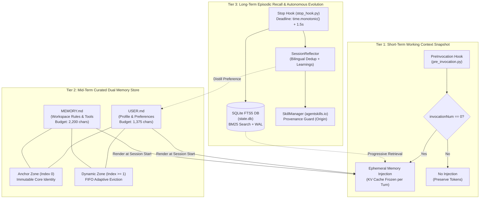

# 01. Architecture Overview: Hermes Engine & 3-Tier Memory

## 1. Executive Summary & Design Philosophy

Modern autonomous AI coding agents face three critical architectural pitfalls:
1. **Context Pollution & Prefix Cache Invalidation**: Naive runtime memory injections mutate prompts mid-turn, destroying key-value (KV) cache reuse and blowing up token costs.
2. **Memory Drift & Hallucinatory Overwriting**: Unrestricted agent self-updates frequently overwrite or dilute foundational user preferences and system constraints.
3. **Runaway Latency on Session Termination**: Complex post-session summarization and reflection pipelines can hang terminal processes, blocking developer workflows.

**Hermes Engine** solves these structural flaws through a **decoupled, provenance-guarded 3-tier memory and reflection architecture**. It separates high-speed interactive user loops from asynchronous out-of-band distillation while enforcing strict character budgets, atomic locks, and monotonic deadlines.

---

## 2. 3-Tier Memory Architecture

### Tier 1: Working Context Snapshot (Short-Term)
- **Lifecycle Injection**: Hooked into runtime via `PreInvocation` (`pre_invocation.py`).
- **Gating**: Injected *exclusively* on `invocationNum == 0` (the first step of a turn). Intra-turn tool executions receive `{"injectSteps": []}`, preserving token budgets.
- **Prefix Cache Stability**: Read-only during active reasoning turns. Zero mid-turn prompt mutation.

### Tier 2: Mid-Term Curated Dual Memory
- **Partitioned Stores**:
  - `USER.md`: User persona, coding style, preferences ($\le 1,375$ characters).
  - `MEMORY.md`: Workspace rules, architecture invariants, environment quirks ($\le 2,200$ characters).
- **Delimiter**: Normalized entries separated strictly by `\n§\n`.
- **Two-Zone Protection Model**:
  - **Zone 0 (Anchor Zone)**: Always preserved at index 0. Immutable against automated deletion or batch eviction.
  - **Zone 1+ (Dynamic Zone)**: Managed via deterministic FIFO eviction when total length exceeds budget.
- **Concurrency & Atomicity**: Atomic file replacement via PID-stamped temporary files (`.tmp.<pid>`) protected by advisory `fcntl.flock(LOCK_EX)` locks.

### Tier 3: Long-Term Episodic Recall & Self-Evolution
- **SQLite FTS5 Storage**: Complete historical transcripts indexed with BM25 relevance ranking.
- **Progressive Retrieval**: Search queries return compact snippets and bounded previews ($\le 1,200$ characters); full messages are fetched on-demand with pagination via `session_get_message`.
- **Out-of-Band Reflection**: Triggered via `Stop` hook on session exit (`stop_hook.py`).
- **Monotonic Deadline Guard**: Reflection processes execute under a strict cooperative deadline (`time.monotonic() + timeout`, default 1.5s) ensuring clean, non-hanging exits.

---

## 3. FastMCP Tool Interface

The Hermes Engine exposes four core tools to AI coding agents via Model Context Protocol (FastMCP):

| Tool | Parameters | Purpose |
| :--- | :--- | :--- |
| `memory` | `action`, `target`, `content`, `old_text`, `operations` | Query or update Tier 2 dual stores with Two-Zone eviction and atomic batch transactions. |
| `skill_manage` | `action`, `name`, `content`, `file_path`, `old_string`, `origin` | Manage procedural skills (`agentskills.io` standard) with write-origin provenance checks. |
| `session_search` | `query`, `limit` | Full-text lexical search across past session history using SQLite FTS5 BM25 ranking. |
| `session_get_message` | `message_id`, `offset`, `limit` | Retrieve paginated message content from past sessions with zero context overflow risk. |

---

## 4. Architectural Invariants & Safety Guarantees

1. **Write-Origin Provenance**:
   - `origin="foreground"`: Granted when users directly command changes. Allows creating, editing, and deleting skills.
   - `origin="background_review"`: Enforced during autonomous reflection. Strictly prohibited from modifying or deleting user-made skills or pinned skills (`pinned: true`).
2. **Metadata Sanitization**:
   - Transcripts ingested into SQLite FTS5 are automatically stripped of system-internal envelopes (`<USER_SETTINGS_CHANGE>`, `<ADDITIONAL_METADATA>`, `<CONTEXT_SUMMARY>`) to prevent search poisoning.
3. **Intra-Turn Tolerance & Rewind Pruning**:
   - The ingestion parser handles async, out-of-order log writes within turns while properly pruning abandoned branches during conversational user rewinds.
