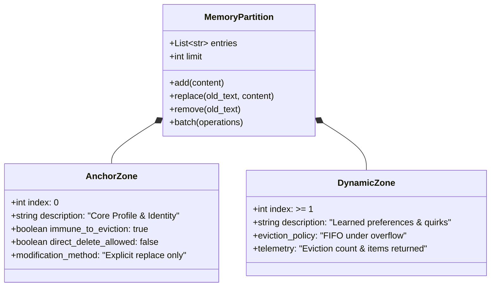
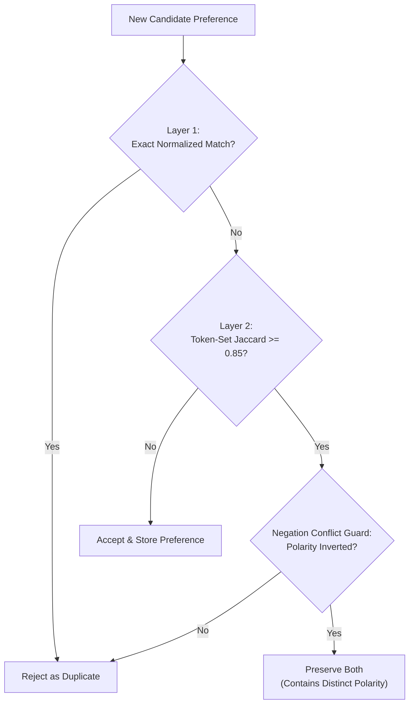

# 02. Two-Zone Memory Specification & Deduplication Engine

## 1. Memory Store Physical Layout

Tier 2 memory is organized into two markdown stores:
- **`USER.md`** (Personal Preferences & Identity): Hard budget limit of **1,375 characters**.
- **`MEMORY.md`** (Workspace Rules & Environment): Hard budget limit of **2,200 characters**.

Entries within each file are separated by a unique unicode delimiter:
```text
\n§\n
```

---

## 2. Two-Zone Protection Architecture



### Zone 0: Anchor Zone
- **Location**: Index 0 of the entries array.
- **Protection**:
  - Strictly immune to automated eviction during memory overflow.
  - Immune to `remove()` and `batch(action="remove")`. Attempting to delete Zone 0 returns an error:
    `"Cannot remove Anchor Zone (index 0). Use 'replace' action to modify identity entries."`
- **Purpose**: Houses the user profile header, operational role, or repository invariants that must never be forgotten or pushed out by accumulated transient preferences.

### Zone 1+: Dynamic Zone
- **Location**: Indices $\ge 1$.
- **Eviction Lifecycle**:
  - When a new preference or rule is added and the file's character budget is exceeded:
  - The store systematically evicts the oldest dynamic entry (Index 1) until the content fits within the budget.
  - If even after evicting all dynamic entries the candidate addition cannot fit alongside the Anchor Zone, the operation is rejected safely with a budget limit error.
- **Eviction Telemetry**:
  - Both `add` and `batch` operations return an `"evicted"` list and `"eviction_count"` so agents and users maintain complete visibility into what was pruned.

---

## 3. Concurrency, Locking, and Atomic I/O

To guarantee safety across concurrent subagents or background hooks:
1. **Advisory File Locking**:
   - Every read operation acquires a shared lock: `fcntl.flock(fd, fcntl.LOCK_SH)`.
   - Every mutation acquires an exclusive lock: `fcntl.flock(fd, fcntl.LOCK_EX)`.
   - Dedicated hidden lockfiles (`.<filename>.lock`) are maintained in the memory directory.
2. **Fresh Disk State Reloading**:
   - Under exclusive lock, `_mutate()` reloads the current on-disk state before executing the modification callback. This prevents race conditions where parallel processes clobber each other's updates.
3. **Atomic File Replacement**:
   - Updates are written to a PID-tagged temporary file: `<target>.tmp.<pid>`.
   - The temporary file is flushed to disk and atomically swapped into place via `os.replace()` (`rename(2)` syscall).
   - In case of an unexpected I/O exception, the temporary file is unlinked cleanly and changes are discarded.

---

## 4. 2-Layer Deduplication Engine

Before inserting learned preferences into `USER.md`, the reflection engine executes a dual-layer deduplication check to prevent memory bloat and contradictory statements.



### Layer 1: Exact Normalized Equality
Strips punctuation, trims whitespace, and compares lowercase representations:
```python
norm_new = re.sub(r'[^\w\s]', '', new_pref.lower()).strip()
norm_old = re.sub(r'[^\w\s]', '', existing_pref.lower()).strip()
if norm_new == norm_old:
    return True
```

### Layer 2: Token-Set Jaccard with Negation Conflict Guard
Calculates set-theoretic word overlap:
$$J(A, B) = \frac{|A \cap B|}{|A \cup B|}$$

- **Threshold**: $J(A, B) \ge 0.85$ triggers duplicate classification.
- **Bilingual Negation Conflict Guard**:
  If either preference contains negation tokens, the engine checks whether their negation sets match. If one statement affirms a trait and the other denies it, they are **not** duplicates:
  ```python
  NEGATION_TOKENS = {
      "tidak", "jangan", "bukan", "tanpa",
      "no", "not", "never", "don't", "dont", "cannot", "cant"
  }
  ```
  - *Example*: `"Gunakan Docker"` vs `"Jangan gunakan Docker"` shares high Jaccard overlap, but the negation guard detects the polarity conflict and preserves the distinct directive.
