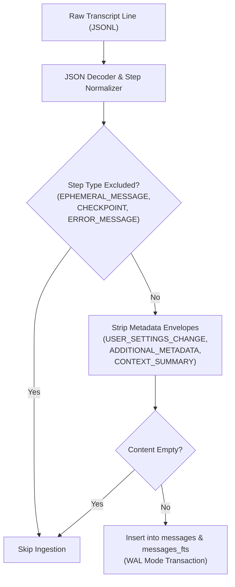

# 03. Episodic Recall: SQLite FTS5 & Progressive Retrieval

## 1. Relational & Virtual Schema

Tier 3 episodic recall is powered by an embedded SQLite database (`state/state.db`) configured in **Write-Ahead Logging (WAL)** mode for high-concurrency read/write throughput.

```sql
-- Session metadata
CREATE TABLE IF NOT EXISTS sessions (
    session_id TEXT PRIMARY KEY,
    workspace TEXT,
    started_at TEXT,
    title TEXT
);

-- Normalized message log
CREATE TABLE IF NOT EXISTS messages (
    id INTEGER PRIMARY KEY AUTOINCREMENT,
    session_id TEXT,
    step_index INTEGER,
    role TEXT,
    content TEXT,
    created_at TEXT,
    UNIQUE(session_id, step_index)
);

-- Full-Text Search Virtual Table (FTS5)
CREATE VIRTUAL TABLE IF NOT EXISTS messages_fts USING fts5(
    content,
    session_id UNINDEXED,
    role UNINDEXED,
    content_rowid UNINDEXED
);
```

---

## 2. Ingestion Pipeline & Metadata Sanitization

Transcripts from agent sessions often include platform-injected metadata, runtime instrumentation, and user settings envelopes. If indexed blindly, these strings contaminate full-text search results.



### Regex Sanitization Engine
The sanitization layer cleans text using non-greedy DOTALL regex filters:
```python
def strip_system_metadata(text: str) -> str:
    if not text:
        return ""
    # Strip <ADDITIONAL_METADATA ...>...</ADDITIONAL_METADATA>
    text = re.sub(r'<ADDITIONAL_METADATA[^>]*>.*?</ADDITIONAL_METADATA>', '', text, flags=re.DOTALL | re.IGNORECASE)
    # Strip <USER_SETTINGS_CHANGE ...>...</USER_SETTINGS_CHANGE>
    text = re.sub(r'<USER_SETTINGS_CHANGE[^>]*>.*?</USER_SETTINGS_CHANGE>', '', text, flags=re.DOTALL | re.IGNORECASE)
    # Strip <CONTEXT_SUMMARY ...>...</CONTEXT_SUMMARY>
    text = re.sub(r'<CONTEXT_SUMMARY[^>]*>.*?</CONTEXT_SUMMARY>', '', text, flags=re.DOTALL | re.IGNORECASE)
    return text.strip()
```

---

## 3. Rewind Handling vs Intra-Turn Out-of-Order Tolerance

In interactive CLI agents, two distinct asynchronous ordering patterns occur:
1. **Intra-turn Out-of-Order Logging**: Tool outputs or background telemetry steps may be flushed to disk after a planner response is recorded, producing step indices that arrive slightly out-of-order within the same turn.
2. **Conversational User Rewinds**: A user reverts or edits a previous prompt, causing the step index to jump backward to an earlier turn index.

### The Canonical Resolution Algorithm
The transcript loader distinguishes these two states safely:
- Rewind pruning is **only** triggered when a **`USER_INPUT`** step arrives with a `step_index` that is less than or equal to the current maximum indexed step.
- Intra-turn tool and assistant step reordering is retained without premature branch deletion.

```python
if step_type in ("USER_INPUT", "user") and active_steps and step_idx <= max(active_steps.keys()):
    for k in [k for k in list(active_steps.keys()) if k >= step_idx]:
        del active_steps[k]
active_steps[step_idx] = step
```

---

## 4. Progressive Retrieval Pattern

To prevent full-text search results from blowing past model context limits:
1. **Search Query Bounding (`session_search`)**:
   - Matches are ranked using the SQLite FTS5 `rank` (BM25 scoring).
   - Results return highlighted snippets (`<b>query</b>`) and message content clamped to **1,200 characters**.
   - If content exceeds 1,200 characters, `content_truncated: true` and `total_length` are provided.
   - `limit` parameter is strictly validated: `limit = max(1, min(100, int(limit)))`.
2. **Targeted Pagination (`session_get_message`)**:
   - If an agent requires the complete transcript of a past conversation turn, it queries `session_get_message` by `message_id`.
   - Supports `offset` and `limit` chunking with `has_more: boolean` status, ensuring safe streaming of multi-megabyte log outputs.
