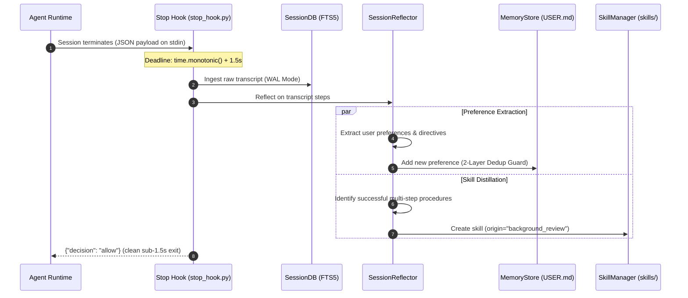

# 04. Autonomous Agent Self-Evolution & Provenance Guardrails

## 1. The Autonomous Reflection Pipeline

Autonomous coding agents must learn and improve across sessions without mutating user-defined invariants or destabilizing core capabilities. Hermes Engine operationalizes this via **asynchronous out-of-band reflection** executed during the `Stop` lifecycle hook.



---

## 2. Strict Write-Origin Provenance Model

Every skill operation within Hermes Engine carries an explicit `origin` attribute to distinguish interactive human commands from background machine reflections.

| Write Origin | Initiator | Capabilities | Restrictions |
| :--- | :--- | :--- | :--- |
| `foreground` | Direct user prompt, slash command, interactive tool call | Full access: create, patch, delete, overwrite any skill. | None. User retains absolute ownership. |
| `background_review` | Autonomous background reflector in `Stop` hook | Create agent skills (`created_by: "agent"`, `agent_created: true`). | **STRICTLY BLOCKED** from: <br>1. Overwriting user-made skills.<br>2. Patching user-made skills.<br>3. Deleting any skill.<br>4. Modifying pinned skills (`pinned: true`). |

### Origin Validation Code Flow
```python
eff_origin = origin if origin is not None else get_current_write_origin()

if eff_origin == "background_review":
    if skill_file.exists() and not self.is_agent_created(name):
        return {"success": False, "error": f"Refusing to overwrite user-made skill '{name}'."}
    if self.is_pinned(name):
        return {"success": False, "error": f"Skill '{name}' is pinned."}
```

---

## 3. Cooperative Monotonic Deadline Architecture

One of the greatest dangers in lifecycle hooks is process hang caused by unbounded LLM calls or disk I/O when exiting.

Hermes Engine enforces **monotonic deadline propagation**:
- A target wall-clock deadline is set at invocation:
  ```python
  deadline = time.monotonic() + max_time_seconds  # Default 1.5s
  ```
- All sub-operations (database ingestion, transcript iteration, preference deduplication, skill compilation) inspect the deadline cooperatively:
  ```python
  if deadline and time.monotonic() > deadline:
      break
  ```
- Regardless of queue depth or database size, the hook completes deterministically within budget and emits `{"decision": "allow"}` to the agent runtime.

---

## 4. Skill Curator & Anti-Bloat Engine

Over long operational periods, autonomous reflection may generate specialized skills that fall out of use. The **Hermes Curator** (`scripts/curator.py`) provides automated hygiene:

1. **Telemetry Tracking (`.usage.json`)**:
   Tracks creation timestamp, creator type (`user` vs `agent`), pinned status, and `last_used` timestamps.
2. **Automated Inactivity Pruning**:
   Moves agent-created skills unused for $> 30$ days into `.archive/` without deleting them. Pinned skills and user-created skills are unconditionally exempted.
3. **Pre-Mutation Tarball Backups**:
   Generates a full gzip archive (`skills_backup_<timestamp>.tar.gz`) before any automated pruning or major batch edit.
4. **Instant Rollback**:
   Allows single-command restoration to the exact previous state (`python3 scripts/curator.py rollback`).
